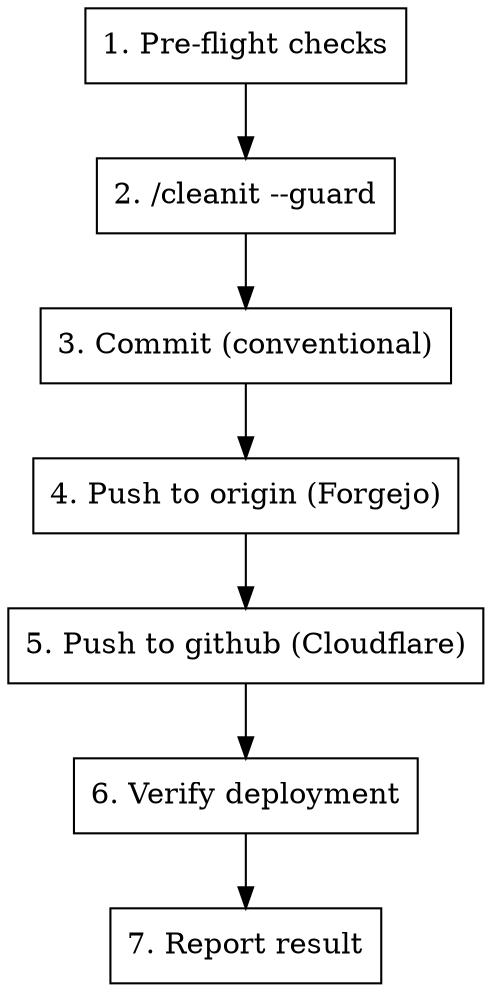

# /sendit — Ship It

Autonomous deploy pipeline: cleanit → commit → push → verify.

## Arguments

- `/sendit` — Auto-detect everything, ship it
- `/sendit fix` — Override commit type to `fix:`
- `/sendit feat` — Override commit type to `feat:`
- `/sendit --dry-run` — Show what would happen without doing it
- `/sendit --skip-review` — Skip cleanit quality gate
- `/sendit --help` — Show this reference

Parse arguments to determine `COMMIT_TYPE` (auto/feat/fix/chore/refactor/docs/test) and `DRY_RUN` (true/false) and `SKIP_REVIEW` (true/false).

## Pipeline



### Step 1: Pre-flight Checks

Run these checks. If ANY fail, stop and report.

```bash
# 1a. Has changes to ship?
git diff --name-only
git diff --cached --name-only
# If both empty, exit: "Nothing to ship"

# 1b. On main branch?
git branch --show-current
# Must be "main" — this project ships from main directly

# 1c. Build passes?
npm run build 2>&1
# Must exit 0

# 1d. Type checking passes?
npm run check 2>&1
# Warnings OK, errors stop the pipeline
```

If `DRY_RUN`, report what was found and stop here.

### Step 2: Quality Gate — /cleanit --guard

**Skip if `SKIP_REVIEW` is true.**

Spawn the `cleanit-reviewer` agent to review changed files:

```
Agent({
  subagent_type: "cleanit-reviewer",
  model: "sonnet",
  description: "Pre-ship quality check",
  prompt: "Run /cleanit --guard on the unstaged changes in this project. Report pass/fail with the default threshold (problem). Return ONLY the verdict: PASS or FAIL with summary."
})
```

- **PASS** → continue to Step 3
- **FAIL** → stop pipeline, report findings, suggest `/cleanit --simplify` to fix

### Step 3: Commit

**Auto-detect commit type** from the diff (if not overridden):
- New files / new exports → `feat:`
- Modified files with bug-fix indicators → `fix:`
- Only docs changed → `docs:`
- Only tests changed → `test:`
- Config/build changes → `chore:`
- Restructure without behavior change → `refactor:`

**Generate commit message:**

```bash
# Stage all changed source files (not screenshots, not .claude/)
git add src/ static/ *.config.* package.json svelte.config.js

# Commit with conventional format
git commit -m "$(cat <<'EOF'
type: concise description of changes

Co-Authored-By: Claude Opus 4.7 (1M context) <noreply@anthropic.com>
EOF
)"
```

- Scope is optional for this project (single app)
- Description: 1 line summarizing the change, lowercase, no period
- Co-Authored-By reflects the model that wrote the commit (the main session). Default is Opus 4.7. If the session runs on a different model, update accordingly. The cleanit-reviewer sub-agent runs on Sonnet but does not author the commit.

### Step 4: Push to Forgejo

```bash
git push origin main
```

If rejected, stop and report: "Push to origin rejected — pull and resolve conflicts first."

### Step 5: Push to GitHub (triggers Cloudflare Pages deploy)

```bash
git push github main
```

If rejected, stop and report. Do NOT force-push.

### Step 6: Verify Deployment

```bash
# Confirm GitHub main matches local
LOCAL_SHA=$(git rev-parse HEAD)
REMOTE_SHA=$(git ls-remote github refs/heads/main | cut -f1)

if [ "$LOCAL_SHA" = "$REMOTE_SHA" ]; then
  echo "VERIFIED: GitHub main matches local ($LOCAL_SHA)"
else
  echo "WARNING: SHA mismatch — local $LOCAL_SHA vs remote $REMOTE_SHA"
fi
```

### Step 7: Report Result

```
/sendit complete:
- Committed: type: description
- Pushed: origin ✓ | github ✓
- Verified: SHA match ✓
- Cloudflare Pages: deploy triggered
```

On any failure:
```
/sendit FAILED at step [N]:
- Error: [what went wrong]
- Action: [what to do next]
- Completed steps: [what succeeded before failure]
```

## Project Config (Hardcoded)

| Setting | Value |
|---------|-------|
| Base branch | `main` |
| Primary remote | `origin` (forge.mms.name/emittiv/emittiv-website) |
| Deploy remote | `github` (github.com/newillusions/emittiv) |
| Deploy trigger | Push to `github` main → Cloudflare Pages auto-deploy |
| Version source | `package.json` (not bumped on every ship) |
| Build command | `npm run build` |
| Check command | `npm run check` |
| Merge strategy | Direct push to main (no PRs for this project) |
| Quality gate | `/cleanit --guard` (default threshold: problem) |

## What This Skill Does NOT Do

- **No version bumping** — emittiv.com doesn't need semver on every deploy
- **No PRs** — this project ships directly from main
- **No npm/cargo publish** — it's a static site deployed via Cloudflare Pages
- **No tagging** — no release tags needed
